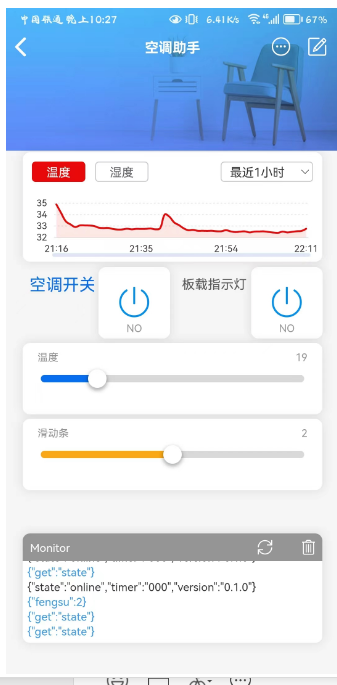

# 基于esp8266的空调助手，可实现开关，温度风速调节（适配格力）

```
1.增加wifimanager库支持，可网页配置blinker auth，使用littlefs存储auth信息
2.可检测ssid、密码、auth错误，重新打开配网页面
3.oled模块首行显示自定义字符，app端新建任一输入框控件，发送相应字符（ASCII）
```
# 使用方法
```
1.设备通电后，连接“空调助手”wifi，自动打开配置界面（192.168.4.1），填入相关信息，设备会确认信息正确，板载蓝灯长亮表示网络未连接，熄灭表示网络正常。
```